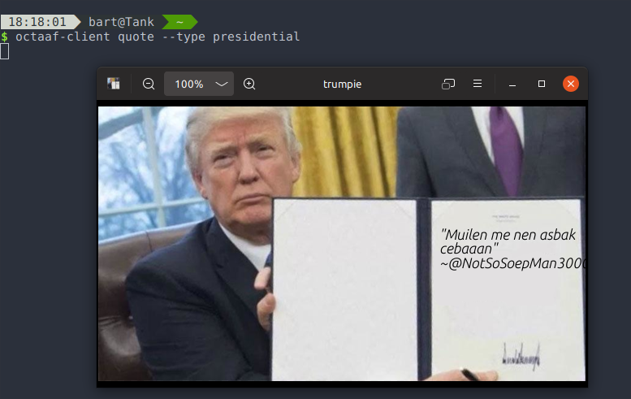

# Octaaf Client

## Usage

```bash
$ octaaf-client
octaaf-client 0.3.0
Bart Willems

USAGE:
    octaaf-client [FLAGS] <SUBCOMMAND>

FLAGS:
    -h, --help       Prints help information
    -V, --version    Prints version information
    -v, --verbose    

SUBCOMMANDS:
    help      Prints this message or the help of the given subcommand(s)
    quote     
    status 
```

### Quotes

```bash
# Random quotes:
$ octaaf-client quote --type text
"In mijn straat was er een klein kindje van 420 jaar da kanker had, hij rook 69 dagen lang wiet en was van zijn anuskanker verlost. Die jonge was bijna president geworden, zijn naam? Bernie Sanders"
        ~pee_is_stored_in_the_brain

# Filter for quotes:
$ octaaf-client quote --type text --filter "best dev"
"bart best dev"
        ~swagnus
```

Presidential quote:



### Status

```bash
$ octaaf-client status
{
  "healthy": true,
  "response": "{\"postgres\":\"Ok\",\"redis\":\"Ok\",\"telegram\":\"Ok\"}",
  "status_code": 200
}
```

